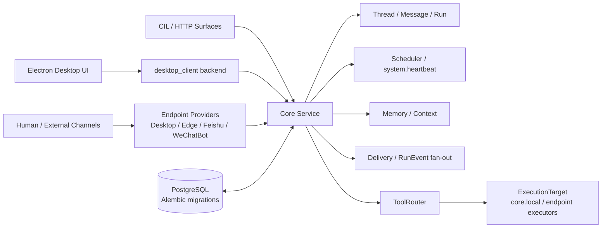

# MeetYou

[English](./README.md) | [简体中文](./README.zh-CN.md)

MeetYou is a personal agent runtime built around LLMs, local desktop execution, scheduled workflows, memory, and multi-channel delivery. The current architecture line is **V4: Core-owned Runtime + Endpoint Routing**.

The short version: Core owns conversations and runtime state; endpoint providers connect humans, devices, tools, and third-party channels without owning the conversation model.



## Why MeetYou Exists

Most assistant projects mix chat UI, tool execution, memory, scheduling, and channel delivery into one surface. That is convenient early on, but it becomes fragile when the same assistant needs to run from a desktop window, an edge machine, Feishu, WeChatBot, scheduled jobs, or future providers.

MeetYou separates those responsibilities:

- **Core is the source of truth** for threads, messages, runs, scheduler state, heartbeat, memory, operations, and delivery.
- **Endpoint Providers are runtime surfaces**. Desktop, Edge, Feishu, WeChatBot, webhook, email, and similar surfaces expose endpoints and capabilities, but they do not own conversations or scheduling semantics.
- **Tool execution is explicit**. Tool dispatch flows through ToolRouter and ExecutionTarget; permissions live on Actor, Workspace, and RunPolicy; executable capability lives on EndpointCapability.
- **Workflow reuse uses SKILL**. Reusable guidance is modeled as SKILL files rather than V3 Procedure APIs.

## What It Can Do

- Run a Core assistant service with persistent Thread / Message / Run state.
- Stream assistant output through RunEventLog and delivery fan-out.
- Connect Desktop and Edge endpoint providers through the V4 `/endpoint/ws` protocol.
- Route local file, workspace, general shell, and local MCP capabilities through endpoint execution targets rather than embedding them in Core. The narrow exception is `exec_core_cmd`, which runs only on the Core Service host under a Core command whitelist.
- Deliver replies, notices, run events, and operation updates to endpoint addresses.
- Support scheduled workflows, scheduled delivery, and the non-deletable `system.heartbeat` job.
- Maintain memory and context pools for assistant grounding.
- Provide an Electron + React desktop UI with thread, operation, memory, workspace, and settings surfaces.
- Integrate optional external providers such as Feishu and WeChatBot.
- Keep Danxi credentials behind encrypted transport and avoid plaintext credential exposure in logs or docs examples.

## Current Status

MeetYou is an active V4 codebase. It is usable for development and self-hosted experimentation, but it is still a fast-moving personal agent runtime rather than a polished end-user product.

The repository is Windows-oriented by default because the desktop provider, launcher, PowerShell scripts, and Electron packaging paths are currently optimized for Windows. Core deployment also supports Linux systemd and Docker-style service layouts.

## Repository Layout

| Path | Purpose |
| --- | --- |
| `main.py` | Development launcher and runtime entrypoints. |
| `core/` | Core assembly, lifecycle, domain services, state, modes, memory, scheduler, delivery, and ToolRouter. |
| `gateway/` | FastAPI HTTP facade and V4 Endpoint WebSocket surface. |
| `service_runtime/` | Production Core runtime entrypoint. |
| `endpoint_tool_sdk/` | Endpoint protocol helpers and provider runtime SDK. |
| `desktop_client/` | Desktop Endpoint Provider runtime and local backend. |
| `edge_client/` | Edge Endpoint Provider runtime. |
| `endpoint_providers/` | Optional Feishu / WeChatBot external providers. |
| `meetyou-ui/` | Electron + React desktop UI. |
| `tools/` | Tool implementations registered through the Core capability path. |
| `prompt/` | Prompt, assistant mode, and SKILL guidance assets. |
| `docs/v4/` | V4 design source of truth and release verification notes. |
| `tests/` | Backend regression and V4 protocol tests. |
| `user/` | Local config templates; real runtime state is ignored by Git. |

## Architecture Boundaries

- The formal V4 HTTP facade is `/runtime/*`.
- The only V4 real-time provider entrypoint is `GET /endpoint/ws`.
- Local Desktop `/desktop/*` may proxy to `/runtime/*`, `/operator/*`, or `/developer/*`.
- `/client/*`, `/client/ws`, `source_client_id`, `target_client_id`, and Client-owned execution semantics are removed from V4 runtime code.
- Provider-internal human destinations, such as Feishu chats or WeChat private/group chats, are `EndpointAddress` records.
- `assistant.progress_notice` is a RunEvent / Runtime Action and must not become a ToolRouter call or final assistant message.
- Final assistant replies must be persisted as assistant messages by MessageService.

See [AGENTS.md](./AGENTS.md) and [docs/v4/](./docs/v4/) for the detailed implementation rules.

## Core Runtime HTTP Contract

Endpoint Providers and desktop surfaces should talk to Core through the V4 runtime facade. The public shape is intentionally endpoint-oriented rather than client-oriented.

| Method | Path | Purpose |
| --- | --- | --- |
| `GET` | `/health` | Service health and build metadata. |
| `GET` | `/runtime/workspaces` | List visible workspaces and workspace execution policy. |
| `GET` | `/runtime/workspaces/{workspace_id}/endpoints` | List endpoint capabilities visible to a workspace. |
| `GET` | `/runtime/threads` | List active Core threads. |
| `POST` | `/runtime/threads` | Create a Core thread. Runtime modes are `general`, `automation`, and `danxi`. |
| `POST` | `/runtime/threads/default` | Resolve or create a default thread for a workspace/key. |
| `GET` | `/runtime/threads/{thread_id}` | Read thread metadata. |
| `DELETE` | `/runtime/threads/{thread_id}` | Soft delete or archive a thread where allowed. |
| `POST` | `/runtime/endpoint-sessions/resolve` | Resolve a provider conversation into Core thread, session, and binding. |
| `POST` | `/runtime/sessions` | Create a runtime session for an endpoint and thread. |
| `PATCH` | `/runtime/sessions/{session_id}/active-workspace` | Switch active workspace for a session. |
| `POST` | `/runtime/messages` | Persist an inbound message and trigger Core reply flow. |
| `GET` | `/runtime/threads/{thread_id}/messages` | List persisted messages for a thread. |
| `POST` | `/runtime/operations` | Create an operation routed through ToolRouter / ExecutionTarget. |
| `GET` | `/runtime/operations/{operation_id}` | Read operation state. |
| `POST` | `/runtime/sessions/{session_id}/confirm-response` | Resolve a confirmation request. |
| `POST` | `/runtime/sessions/{session_id}/human-input-response` | Resolve a human-input request. |
| `POST` | `/runtime/sessions/{session_id}/reply-control` | Send stop/regenerate-style runtime reply control. |
| `POST` | `/runtime/approvals/{approval_id}/decision` | Approve or reject a pending operation approval. |

Minimal endpoint session resolution:

```http
POST /runtime/endpoint-sessions/resolve
Authorization: Bearer <token>
Content-Type: application/json

{
  "endpoint_id": "feishu.main.ui",
  "workspace_id": "personal",
  "provider_type": "feishu",
  "endpoint_type": "feishu_ui",
  "conversation_key": "chat:<provider-conversation-id>",
  "address_id": "addr.feishu.group.<stable-id>",
  "thread_strategy": "per_conversation",
  "title": "Feishu group"
}
```

The response returns a Core `thread`, a runtime `session`, and an endpoint-thread `binding`. Final assistant replies must be persisted as assistant messages in that thread.

Minimal inbound message:

```http
POST /runtime/messages
Authorization: Bearer <token>
Content-Type: application/json

{
  "thread_id": "thr_xxx",
  "session_id": "ses_xxx",
  "endpoint_id": "feishu.main.ui",
  "workspace_id": "personal",
  "role": "user",
  "content": "Summarize today's plan",
  "metadata": {
    "source_kind": "feishu",
    "address_id": "addr.feishu.group.<stable-id>"
  }
}
```

## Endpoint WebSocket Protocol

The only V4 real-time Provider entrypoint is:

```http
GET /endpoint/ws
Authorization: Bearer <token>
```

Every frame uses the `meetyou.endpoint.ws.v4` envelope:

```json
{
  "schema": "meetyou.endpoint.ws.v4",
  "type": "endpoint.hello",
  "message_id": "msg_xxx",
  "sent_at": "2026-05-01T00:00:00Z",
  "endpoint_id": "desktop.main.executor",
  "correlation_id": "",
  "payload": {}
}
```

Provider handshake:

1. Provider sends `endpoint.hello` with provider identity, endpoint list, and V4 protocol offer.
2. Core replies `endpoint.hello.ack`.
3. Provider sends `endpoint.capabilities.snapshot` when Core requests `requires_capabilities_snapshot`.
4. Core replies `endpoint.ready`.
5. Provider sends `endpoint.addresses.snapshot` if it owns human-visible provider addresses.
6. Provider sends periodic `endpoint.heartbeat` for connection keepalive only.
7. Provider sends `endpoint.goodbye` before intentional disconnect.

Formal V4 frame groups:

| Group | Frames |
| --- | --- |
| Lifecycle | `endpoint.hello`, `endpoint.hello.ack`, `endpoint.capabilities.snapshot`, `endpoint.ready`, `endpoint.heartbeat`, `endpoint.goodbye` |
| Address | `endpoint.addresses.snapshot`, `endpoint.address.upsert`, `endpoint.address.delete` |
| Subscription | `subscription.start`, `subscription.ack`, `subscription.update`, `subscription.stop` |
| Delivery | `delivery.message`, `delivery.run_event`, `delivery.notice`, `delivery.operation_update`, `delivery.inbox_item` |
| Tool | `tool.call.request`, `tool.call.accepted`, `tool.call.progress`, `tool.call.result`, `tool.call.error`, `tool.call.cancel` |

Address-targeted `delivery.message` and `delivery.notice` payloads include `target_address_id`, `target_provider_type`, `target_address_type`, and `target_external_ref`. Cross-provider human-visible delivery should target an `EndpointAddress` through Delivery.

## Developing An Endpoint Provider

Use [docs/v4/endpoint-provider-template.md](./docs/v4/endpoint-provider-template.md) as the implementation checklist. The usual path is:

1. Choose a stable provider id, provider type, endpoint ids, and endpoint roles.
2. Model provider-internal human destinations as `EndpointAddress`, not as clients.
3. Implement the `/endpoint/ws` lifecycle handshake and feature negotiation.
4. Send endpoint capability snapshots for executable tools and UI/input/output roles.
5. Maintain subscriptions for thread, workspace, or address delivery streams.
6. Resolve inbound provider conversations through `/runtime/endpoint-sessions/resolve`.
7. Persist inbound user messages through `/runtime/messages`.
8. Execute tool calls only when routed through `tool.call.request`; report progress, result, error, or cancellation with matching `call_id`.
9. Add conformance tests for hello, capability snapshot, address upsert/delete, subscription start/update/stop, delivery fan-out, tool result/error/cancel, and reconnect behavior.

Provider implementation entrypoints:

| Path | Use |
| --- | --- |
| `endpoint_tool_sdk/protocol.py` | Frame builders and payload models. |
| `endpoint_tool_sdk/runtime.py` | Base runtime for provider WebSocket handling and tool call dispatch. |
| `endpoint_tool_sdk/security.py` | Local endpoint security helpers. |
| `desktop_client/runtime.py` | Desktop provider runtime reference. |
| `edge_client/runtime.py` | Edge provider runtime reference. |
| `endpoint_providers/feishu.py` | External Feishu provider wiring. |
| `endpoint_providers/meetwechat.py` | External WeChatBot provider wiring. |
| `tests/test_endpoint_protocol_v4.py` | Protocol-level test examples. |
| `tests/test_endpoint_tool_protocol.py` | Tool frame test examples. |

## Quick Start

### Prerequisites

- Windows for the full desktop development path.
- Python 3.11+.
- Node.js 20+ for the Electron UI.
- PostgreSQL for the formal persistence layer.

### Install

```powershell
python -m venv .venv
.venv\Scripts\activate
pip install -r requirements.txt
```

For split production installs:

```powershell
pip install -r requirements-core.txt
pip install -r requirements-desktop-client.txt
pip install -r requirements-edge-client.txt
```

Frontend setup:

```powershell
cd meetyou-ui
npm install
```

### Configure

Copy templates and fill local secrets outside Git:

```powershell
Copy-Item .env.example .env
Copy-Item user\config.example.json user\config.json
Copy-Item user\desktop_client.example.json user\desktop_client.json
Copy-Item user\edge_client.example.json user\edge_client.json
Copy-Item user\core_cmd_policy.example.json user\core_cmd_policy.json
```

Important rules:

- Real secrets belong in `.env` or local `user/*.json` files that are ignored by Git.
- `user/config.json` is required for normal startup.
- Core-host command execution is controlled by `core_shell_exec_enabled`, `core_cmd_policy_path`, `core_command_timeout_seconds`, and `core_command_output_max_chars`. Missing or invalid `user/core_cmd_policy.json` falls back to the built-in whitelist, not allow-all.
- `exec_core_cmd` is Core-host only; `exec_sys_cmd` remains the Desktop/Endpoint shell tool.
- PostgreSQL is the formal persistence layer; service startup runs Alembic migrations through `bootstrap_core_domain()`.
- Use `MEETYOU_CLIENT_ACCESS_TOKEN` or Gateway/Core access tokens for provider access.

### Run

Core service:

```powershell
python main.py service
```

Desktop provider:

```powershell
python main.py desktop-client
```

Edge provider:

```powershell
python main.py edge-client
```

Electron UI development:

```powershell
cd meetyou-ui
npm run dev
```

Desktop runtime config sources:

- Development mode reads the repository root `.env` and `user/desktop_client.json`, then Electron starts the local backend with `python main.py desktop-client`.
- Packaged mode does not read the development checkout. It seeds Electron `userData\meetyou-runtime` from the installer resource `resources/runtime-template`, then reads `%APPDATA%\MeetYou\meetyou-runtime\.env` and `%APPDATA%\MeetYou\meetyou-runtime\user\desktop_client.json`.
- The renderer talks only to the local desktop bridge under `/desktop/*`. The default bridge is `127.0.0.1:38951`; if that address is occupied by another process, Electron switches to an available port before exposing the bridge URL to the renderer.
- `npm run build` builds the packaged Python desktop backend before Electron Builder runs, so installers include `resources/desktop-backend` and the runtime template. The default runtime template comes from `user/desktop_client.example.json`, not the local real config or `.env`. Set `MEETYOU_DESKTOP_RELEASE_CORE_BASE_URL` for a release Core URL, or point `MEETYOU_DESKTOP_RUNTIME_CONFIG_FILE` / `MEETYOU_DESKTOP_RUNTIME_ENV_FILE` at explicit release templates when a packaged runtime needs prefilled values.

Launcher:

```powershell
python main.py
```

## Verification

Backend:

```powershell
.venv\Scripts\python.exe -m unittest discover -s tests -p "test_*.py"
```

Frontend:

```powershell
cd meetyou-ui
npm run typecheck
npm run test
npm run build:ui
```

Desktop installer build on Windows:

```powershell
cd meetyou-ui
npm run build
```

Manual V4 acceptance:

```powershell
scripts\manual-acceptance.cmd check
```

Frontend acceptance should include a real browser or Electron visual check when UI behavior changes.

## Security And Privacy

- The repository tracks examples, not real local runtime state.
- `.env`, `.env.*`, `user/*.json`, logs, build outputs, release artifacts, local databases, and packaged runtime folders are ignored.
- Do not paste credentials, cookies, tokens, chat IDs, personal screenshots, or private hostnames into issues, logs, docs, tests, or screenshots.
- Report vulnerabilities through [SECURITY.md](./SECURITY.md).

## Documentation

- [V4 design](./docs/v4/meetyou-v4-design.md)
- [V4 scheduled workflows](./docs/v4/meetyou-v4-scheduled-workflows.md)
- [V4 Core command exception](./docs/v4/core-command-exception.md)
- [Endpoint provider template](./docs/v4/endpoint-provider-template.md)
- [Core API surfaces](./docs/core-api-surfaces.md)
- [Storage and binary transfer](./docs/storage-and-binary-transfer.md)
- [Workspace capability model](./docs/workspace-capability-model.md)
- [Manual startup acceptance](./docs/manual-startup-acceptance.md)
- [Publication readiness checklist](./docs/publication-readiness.md)

## Community

- License: [MIT](./LICENSE)
- Contributing: [CONTRIBUTING.md](./CONTRIBUTING.md)
- Code of conduct: [CODE_OF_CONDUCT.md](./CODE_OF_CONDUCT.md)
- Security policy: [SECURITY.md](./SECURITY.md)
- Support: [SUPPORT.md](./SUPPORT.md)
