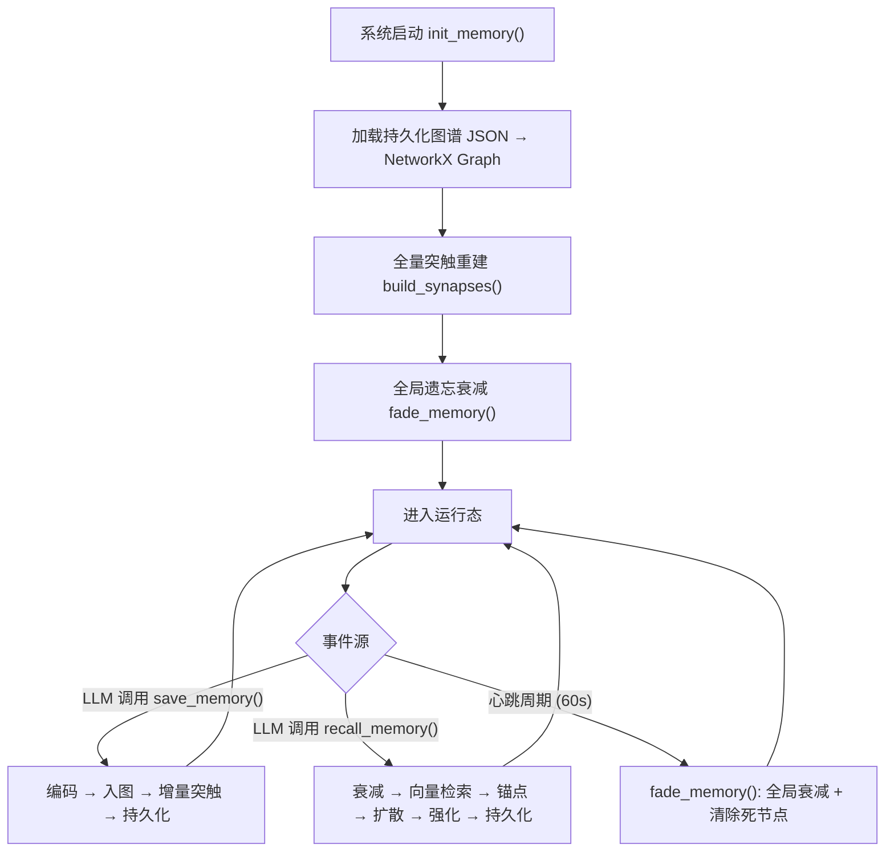

# MeetYou

MeetYou 是一个基于大语言模型（LLM）的仿生智能体应用，旨在模拟人类认知过程。项目采用高度模块化的生物隐喻架构，将功能划分为"大脑"（Brain）负责推理、"心脏"（Heart）驱动后台潜意识、"记忆"（Memory）实现长时记忆存储与召回、以及"感官"（Sensors）处理交互输入输出。

## 核心特性

- ** 仿生认知架构：** 高度模块化设计，由核心大脑（LLM 推理引擎）、心脏（后台心跳事件循环）、记忆系统（长时存储与检索）和感官系统（I/O 处理）协同运作。
- ** 高级上下文管理：** 运用滑动窗口、动态摘要和长时记忆检索（RAG / 知识图谱）等策略，在长对话中维持深层语义连贯性。
- ** 记忆图谱系统：** 核心算法模块，基于语义向量嵌入和图网络构建类人记忆系统，详见下方技术论述。
- ** 异步流式 CLI：** 基于 `prompt_toolkit` 实现非阻塞异步终端界面，支持实时逐字流式输出。
- ** 多模型支持：** 灵活接入 OpenAI、Ollama 等多种 LLM 推理后端，支持同一供应商下多模型并行启用。

---

## 记忆图谱算法：技术论述

### 1. 概述（Abstract）

MeetYou 的记忆系统提出了一种**基于语义向量嵌入的动态知识图谱**（Semantic Embedding-based Dynamic Knowledge Graph）方案，用于为 LLM 智能体提供持久化、可遗忘、可联想的长时记忆能力。该系统以 `NetworkX` 无向图为底层数据结构，以**文本嵌入向量**（Text Embedding Vector）为语义表示，通过**余弦相似度**驱动边（"突触"）的生成与更新，并引入**指数衰减遗忘机制**和**情绪权重调制**来模拟人类记忆的动态特性。

### 2. 图结构定义（Graph Formalization）

记忆图谱 $G = (V, E)$ 是一个无向加权图，其中：

**节点 $v_i \in V$（记忆节点）** 的属性定义为一个五元组：

| 属性 | 符号 | 类型 | 描述 |
|---|---|---|---|
| `content` | $c_i$ | `string` | 记忆的原始文本内容 |
| `vector` | $\vec{e}_i$ | `float[]` | 由外部 Embedding API 编码的高维语义向量 |
| `memory_weight` | $w_i$ | `float` | 记忆强度权重，表示该记忆被遗忘的难易程度 |
| `emotion_intensity` | $\epsilon_i$ | `float ∈ [0, 1]` | 情绪强度系数，调节记忆初始权重与召回强化幅度 |
| `node_id` | $\text{id}_i$ | `string` | 由 `SHA-256(content)` 截取前 16 位生成的确定性唯一标识 |

**边 $e_{ij} \in E$（突触连接）** 携带属性：

| 属性 | 符号 | 描述 |
|---|---|---|
| `sim_weight` | $s_{ij}$ | 两节点嵌入向量的余弦相似度，充当突触强度 |

### 3. 核心算法（Core Algorithms）

#### 3.1 记忆编码与存储（Memory Encoding & Storage）

当 LLM 决定持久化一条信息时，系统执行以下流程：

1. **向量化：** 调用外部 Embedding API 将文本 $c$ 编码为高维向量 $\vec{e}$。
2. **去重检验：** 以 `SHA-256(c)[:16]` 生成确定性节点 ID，若图中已存在该 ID 则拒绝写入。
3. **权重初始化：** 初始记忆权重通过情绪强度线性调制：
   $$w_0 = 0.5 + \epsilon \times 0.5$$
   其中 $\epsilon \in [0, 1]$，使得日常琐事（$\epsilon \approx 0.2$）的初始权重约为 $0.6$，而强烈情感事件（$\epsilon \approx 1.0$）的初始权重达到 $1.0$。
4. **增量突触构建：** 新节点入图后立即触发 `rebuild_synapses`，仅计算新节点与所有既有节点的相似度（复杂度 $O(N)$），避免全量重建。相似度阈值 $\theta_{\text{incr}} = 0.7$。

#### 3.2 突触构建算法（Synapse Construction）

突触构建是记忆图谱的核心关联机制，分为两种模式：

**全量批次重建 `build_synapses()`** — 在系统初始化或"睡眠"周期执行：

```
输入：记忆图 G = (V, E)
输出：更新后的边集 E'

1. 提取所有节点的有效嵌入向量，构成矩阵 M ∈ ℝ^{N×D}
2. 按行归一化：M̂ = M / ‖M‖₂  （L2-norm, 零向量保护）
3. 计算全局相似度矩阵：S = M̂ · M̂ᵀ  （矩阵乘法, O(N²D)）
4. 遍历上三角 S[i,j] (i < j):
     若 S[i,j] > θ_batch (0.5):
       - 边不存在 → 创建边 (v_i, v_j, sim_weight=S[i,j])
       - 边已存在且 |Δweight| > 0.01 → 更新权重（静默）
```

该方法通过 **NumPy 矩阵运算**将 $O(N^2)$ 次独立余弦相似度计算优化为单次矩阵乘法 $S = \hat{M}\hat{M}^T$，利用 BLAS 级别的向量化加速，在节点规模较大时获得显著性能提升。

**增量重建 `rebuild_synapses(new_id)`** — 在新节点写入时即时触发：

```
输入：新节点 ID, 记忆图 G
输出：新节点的突触边集

1. 提取新节点向量 ê_new
2. 逐一计算 cos(ê_new, ê_i) ∀ v_i ∈ V \ {v_new}
3. 若 cos > θ_incr (0.7) → 建立边 (v_new, v_i)
```

增量模式采用较高阈值（$0.7$ vs $0.5$），确保实时操作仅建立高置信度关联，而宽松关联留给批次周期处理。

#### 3.3 指数衰减遗忘机制（Exponential Decay Forgetting）

遗忘模型灵感来源于 Ebbinghaus 遗忘曲线。系统在每个心跳周期（默认 60 秒）触发一次衰减：

$$w_i^{(t+1)} = w_i^{(t)} \times \lambda, \quad \lambda = 0.95$$

当权重衰减至清除阈值 $w_i \leq \theta_{\text{forget}} = 0.2$ 时，节点及其所有关联边从图中永久移除。

这意味着一个初始权重为 $1.0$ 的强记忆，在无任何召回强化的情况下：
- 经过约 **10 个周期** 衰减至 $\approx 0.60$
- 经过约 **32 个周期** 衰减至 $\approx 0.19$（被清除）

而初始权重为 $0.6$ 的弱记忆仅能存活约 **21 个周期** 即被遗忘。情绪强度通过初始权重间接影响记忆的"自然寿命"。

#### 3.4 记忆召回与扩散激活（Recall & Spreading Activation）

召回过程模拟了人类记忆的"联想"特性，分为**锚点定位**和**扩散检索**两个阶段：

**阶段一：语义锚点定位**
```
1. 将查询文本编码为向量 ê_query
2. 遍历所有节点，计算 cos(ê_query, ê_i)
3. 选取最高分节点作为锚点 v_anchor（需 score ≥ 0.4）
```

**阶段二：图扩散检索（Ego-Graph Spreading Activation）**
```
1. 以 v_anchor 为中心，提取 k-hop 子图（默认 k=3）
   SubG = ego_graph(G, v_anchor, radius=3)
2. 遍历 SubG 中所有节点：
   若 w_i ≥ θ_recall (0.4) → 纳入结果集
3. 对被召回的节点执行"记忆强化"
```

**记忆强化公式：**
$$w_i^{(\text{new})} = w_i + \frac{10 \times \epsilon_i}{1 + w_i}$$

该公式具有以下特性：
- **情绪放大（Emotion Amplification）：** 高情绪强度 $\epsilon_i$ 的记忆在被召回时获得更强的权重增益，模拟"刻骨铭心"的记忆效应。
- **边际递减（Diminishing Returns）：** 分母 $1 + w_i$ 随现有权重增长，使得已经很强的记忆不会被无限强化，防止单一记忆垄断，保持图结构的多样性。

### 4. 系统生命周期（System Lifecycle）



### 5. 设计动机与理论关联（Design Rationale）

| 设计选择 | 理论灵感 |
|---|---|
| 指数衰减遗忘（$\lambda = 0.95$） | Ebbinghaus 遗忘曲线（1885） |
| 情绪调制权重 | Yerkes-Dodson 定律；杏仁核-海马体情绪记忆增强机制 |
| 扩散激活检索 | Collins & Loftus 扩散激活模型（1975） |
| 召回时权重强化 | 测试效应（Testing Effect）；Bjork 必要难度理论（Desirable Difficulties） |
| 突触（边）以相似度为权重 | Hebb 定律："Neurons that fire together wire together" |
| 边际递减强化公式 | 韦伯-费希纳定律（Weber–Fechner Law）对数感知增长 |

---

## 项目结构

| 路径 | 描述 |
|---|---|
| `core/` | 核心认知模块：`brain.py`（推理引擎）、`heart.py`（心跳循环）、`context.py`（上下文总线）、`sensors.py`（I/O 感官）、`config_manage.py`（配置管理） |
| `tools/` | 可扩展工具集，核心为 `memory.py`（记忆图谱系统） |
| `prompt/` | 系统级和特定场景 Prompt 模板 |
| `user/` | 用户数据目录，存储个性化记忆图谱等持久化数据（已 git-ignore） |
| `main.py` | 入口文件，编排异步事件循环，启动智能体 "Mozart" |

## 快速开始

### 环境要求
- Python 3.8+
- LLM 推理后端的 API Key（如 OpenAI、Ollama）

### 安装
1. 克隆仓库：
   ```bash
   git clone https://github.com/CodeMzt/MeetYou.git
   cd MeetYou
   ```
2. 创建并激活虚拟环境（推荐）：
   ```bash
   python -m venv .venv
   source .venv/bin/activate  # Windows: .venv\Scripts\activate
   ```
3. 安装依赖：
   ```bash
   pip install -r requirements.txt
   ```

### 配置
在项目根目录下创建 `user/` 文件夹，并在其中新建 `user/config.json` 文件（该目录已通过 `.gitignore` 排除，**请勿将含有密钥的配置文件提交到版本控制**）。

配置文件示例：
```json
{
    "api_key": "YOUR_API_KEY",
    "api_url": "https://api.openai.com/v1/chat/completions",
    "model": "gpt-4o",
    "embedding_api_key": "YOUR_EMBEDDING_API_KEY",
    "embedding_api_url": "https://api.openai.com/v1/embeddings",
    "embedding_model": "text-embedding-3-small",
    "tools_schema_path": "tools.json",
    "soul_path": "prompt/soul",
    "start_path": "prompt/start",
    "heartbeat_path": "prompt/heartbeat",
    "memory_file_path": "user/memory.json"
}
```

### 运行
```bash
python main.py
```

## 作者

<a href="https://github.com/Codemzt">
  
</a>

---

## License

This project is licensed under the MIT License — see the [LICENSE](LICENSE) file for details.
