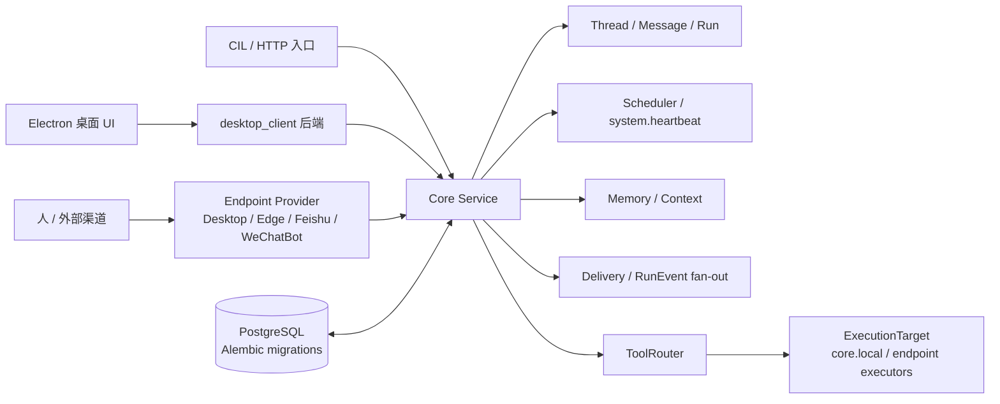

# MeetYou

[English](./README.md) | [简体中文](./README.zh-CN.md)

MeetYou 是一个围绕 LLM、本地桌面执行、计划工作流、记忆和多渠道投递构建的个人智能体运行时。当前主线是 **V4: Core-owned Runtime + Endpoint Routing**。

一句话概括：Core 拥有会话与运行时状态；Endpoint Provider 负责连接人、设备、工具和第三方渠道，但不拥有会话模型。



## 项目初衷

很多助手项目会把聊天界面、工具执行、记忆、调度和渠道投递揉在一个入口里。早期这样做很快，但当同一个助手需要同时运行在桌面窗口、边缘机器、飞书、微信、计划任务或未来 Provider 上时，边界会变得脆弱。

MeetYou 选择把这些责任拆开：

- **Core 是事实来源**：统一拥有 Thread、Message、Run、Scheduler、Heartbeat、Memory、Operation 和 Delivery。
- **Endpoint Provider 是运行时表面**：Desktop、Edge、Feishu、WeChatBot、webhook、email 等负责接入与能力暴露，但不拥有会话和调度语义。
- **工具执行显式路由**：ToolRouter 通过 ExecutionTarget 调度；权限归 Actor、Workspace、RunPolicy；执行能力归 EndpointCapability。
- **复用工作流使用 SKILL**：可复用流程指导使用 SKILL 文件，而不是 V3 Procedure API。

## 能力概览

- 运行带持久化 Thread / Message / Run 状态的 Core assistant service。
- 通过 RunEventLog 和 Delivery fan-out 实现流式输出。
- 使用 V4 `/endpoint/ws` 协议连接 Desktop 和 Edge Endpoint Provider。
- 将本地文件、workspace、通用 Shell、local MCP 能力通过 endpoint execution target 路由，而不是塞回 Core。唯一窄例外是 `exec_core_cmd`，它只在 Core Service 主机上按 Core 命令白名单执行。
- 向 EndpointAddress 投递回复、notice、run event 和 operation update。
- 支持 Scheduled Workflow、Scheduled Delivery 和不可删除的 `system.heartbeat` 系统任务。
- 维护 Memory / Context pool，用于助手上下文和检索增强。
- 提供 Electron + React 桌面 UI，覆盖 thread、operation、memory、workspace 和 settings。
- 可选接入 Feishu、WeChatBot 等外部 Provider。
- Danxi 凭据走加密传输，避免在日志、错误对象、快照、测试或文档示例中暴露明文。

## 当前状态

MeetYou 是活跃迭代中的 V4 代码库。它可用于开发和自托管实验，但仍是快速演进的个人智能体运行时，不是已经完全产品化的终端用户软件。

仓库默认偏 Windows：桌面 Provider、launcher、PowerShell 脚本和 Electron 打包路径主要面向 Windows。Core 服务也提供 Linux systemd 和 Docker 风格部署路径。

## 仓库结构

| 路径 | 作用 |
| --- | --- |
| `main.py` | 开发 launcher 和运行入口。 |
| `core/` | Core 组装、生命周期、领域服务、状态、模式、记忆、调度、投递和 ToolRouter。 |
| `gateway/` | FastAPI HTTP facade 与 V4 Endpoint WebSocket surface。 |
| `service_runtime/` | 生产 Core runtime 入口。 |
| `endpoint_tool_sdk/` | Endpoint 协议辅助函数和 Provider runtime SDK。 |
| `desktop_client/` | Desktop Endpoint Provider runtime 与本地后端。 |
| `edge_client/` | Edge Endpoint Provider runtime。 |
| `endpoint_providers/` | 可选 Feishu / WeChatBot 外部 Provider。 |
| `meetyou-ui/` | Electron + React 桌面 UI。 |
| `tools/` | 通过 Core capability path 注册的工具实现。 |
| `prompt/` | Prompt、assistant mode 与 SKILL 指导资产。 |
| `docs/v4/` | V4 设计事实来源和发布验证记录。 |
| `tests/` | 后端回归和 V4 协议测试。 |
| `user/` | 本地配置模板；真实运行态由 Git 忽略。 |

## 架构边界

- 正式 V4 HTTP facade 是 `/runtime/*`。
- 唯一 V4 实时 Provider 入口是 `GET /endpoint/ws`。
- 本地 Desktop `/desktop/*` 可以代理到 `/runtime/*`、`/operator/*` 或 `/developer/*`。
- `/client/*`、`/client/ws`、`source_client_id`、`target_client_id` 和 Client-owned execution 语义已从 V4 runtime 移除。
- Provider 内部的人类可见目的地，例如飞书会话或微信私聊/群聊，是 `EndpointAddress`。
- `assistant.progress_notice` 是 RunEvent / Runtime Action，不能变成 ToolRouter call，也不能成为最终 assistant message。
- 最终 assistant 回复必须由 MessageService 持久化为 assistant message。

详细实现规则见 [AGENTS.md](./AGENTS.md) 和 [docs/v4/](./docs/v4/)。

## Core Runtime HTTP 契约

Endpoint Provider 和桌面表面应通过 V4 runtime facade 与 Core 通信。公开形态刻意面向 endpoint，而不是面向旧 client。

| Method | Path | 作用 |
| --- | --- | --- |
| `GET` | `/health` | 服务健康状态和 build metadata。 |
| `GET` | `/runtime/workspaces` | 列出可见 workspace 和 workspace execution policy。 |
| `GET` | `/runtime/workspaces/{workspace_id}/endpoints` | 列出 workspace 可见 endpoint capabilities。 |
| `GET` | `/runtime/threads` | 列出活跃 Core threads。 |
| `POST` | `/runtime/threads` | 创建 Core thread。Runtime modes 是 `general`、`automation`、`danxi`。 |
| `POST` | `/runtime/threads/default` | 按 workspace/key 解析或创建默认 thread。 |
| `GET` | `/runtime/threads/{thread_id}` | 读取 thread metadata。 |
| `DELETE` | `/runtime/threads/{thread_id}` | 在允许时软删除或归档 thread。 |
| `POST` | `/runtime/endpoint-sessions/resolve` | 把 provider conversation 解析为 Core thread、session 和 binding。 |
| `POST` | `/runtime/sessions` | 为 endpoint 和 thread 创建 runtime session。 |
| `PATCH` | `/runtime/sessions/{session_id}/active-workspace` | 切换 session active workspace。 |
| `POST` | `/runtime/messages` | 持久化 inbound message，并触发 Core reply flow。 |
| `GET` | `/runtime/threads/{thread_id}/messages` | 列出 thread 持久化消息。 |
| `POST` | `/runtime/operations` | 创建经 ToolRouter / ExecutionTarget 路由的 operation。 |
| `GET` | `/runtime/operations/{operation_id}` | 读取 operation state。 |
| `POST` | `/runtime/sessions/{session_id}/confirm-response` | 响应 confirmation request。 |
| `POST` | `/runtime/sessions/{session_id}/human-input-response` | 响应 human-input request。 |
| `POST` | `/runtime/sessions/{session_id}/reply-control` | 发送 stop/regenerate 等 runtime reply control。 |
| `POST` | `/runtime/approvals/{approval_id}/decision` | 通过或拒绝 pending operation approval。 |

最小 endpoint session resolve：

```http
POST /runtime/endpoint-sessions/resolve
Authorization: Bearer <token>
Content-Type: application/json

{
  "endpoint_id": "feishu.main.ui",
  "workspace_id": "personal",
  "provider_type": "feishu",
  "endpoint_type": "feishu_ui",
  "conversation_key": "chat:<provider-conversation-id>",
  "address_id": "addr.feishu.group.<stable-id>",
  "thread_strategy": "per_conversation",
  "title": "Feishu group"
}
```

响应会返回 Core `thread`、runtime `session` 和 endpoint-thread `binding`。最终 assistant 回复必须持久化到该 thread 的 assistant message 中。

最小 inbound message：

```http
POST /runtime/messages
Authorization: Bearer <token>
Content-Type: application/json

{
  "thread_id": "thr_xxx",
  "session_id": "ses_xxx",
  "endpoint_id": "feishu.main.ui",
  "workspace_id": "personal",
  "role": "user",
  "content": "总结今天的安排",
  "metadata": {
    "source_kind": "feishu",
    "address_id": "addr.feishu.group.<stable-id>"
  }
}
```

## Endpoint WebSocket 协议

唯一 V4 实时 Provider 入口是：

```http
GET /endpoint/ws
Authorization: Bearer <token>
```

所有 frame 使用 `meetyou.endpoint.ws.v4` envelope：

```json
{
  "schema": "meetyou.endpoint.ws.v4",
  "type": "endpoint.hello",
  "message_id": "msg_xxx",
  "sent_at": "2026-05-01T00:00:00Z",
  "endpoint_id": "desktop.main.executor",
  "correlation_id": "",
  "payload": {}
}
```

Provider handshake：

1. Provider 发送 `endpoint.hello`，包含 provider identity、endpoint list 和 V4 protocol offer。
2. Core 回复 `endpoint.hello.ack`。
3. 当 Core 要求 `requires_capabilities_snapshot` 时，Provider 发送 `endpoint.capabilities.snapshot`。
4. Core 回复 `endpoint.ready`。
5. 如果 Provider 拥有人类可见地址，发送 `endpoint.addresses.snapshot`。
6. Provider 周期发送 `endpoint.heartbeat`，它只用于连接 keepalive。
7. Provider 主动断开前发送 `endpoint.goodbye`。

正式 V4 frame 分组：

| 分组 | Frames |
| --- | --- |
| Lifecycle | `endpoint.hello`, `endpoint.hello.ack`, `endpoint.capabilities.snapshot`, `endpoint.ready`, `endpoint.heartbeat`, `endpoint.goodbye` |
| Address | `endpoint.addresses.snapshot`, `endpoint.address.upsert`, `endpoint.address.delete` |
| Subscription | `subscription.start`, `subscription.ack`, `subscription.update`, `subscription.stop` |
| Delivery | `delivery.message`, `delivery.run_event`, `delivery.notice`, `delivery.operation_update`, `delivery.inbox_item` |
| Tool | `tool.call.request`, `tool.call.accepted`, `tool.call.progress`, `tool.call.result`, `tool.call.error`, `tool.call.cancel` |

面向地址的 `delivery.message` 和 `delivery.notice` payload 包含 `target_address_id`、`target_provider_type`、`target_address_type` 和 `target_external_ref`。跨 provider 的人类可见投递应通过 Delivery 指向 `EndpointAddress`。

## 开发 Endpoint Provider

使用 [docs/v4/endpoint-provider-template.md](./docs/v4/endpoint-provider-template.md) 作为实现 checklist。常规路径是：

1. 选择稳定的 provider id、provider type、endpoint ids 和 endpoint roles。
2. 将 provider 内部的人类目的地建模为 `EndpointAddress`，不要建模为 client。
3. 实现 `/endpoint/ws` 生命周期 handshake 和 feature negotiation。
4. 为可执行工具、UI/input/output roles 发送 endpoint capability snapshot。
5. 维护 thread、workspace 或 address delivery stream 的 subscriptions。
6. 通过 `/runtime/endpoint-sessions/resolve` 解析 inbound provider conversation。
7. 通过 `/runtime/messages` 持久化 inbound user message。
8. 只有收到 `tool.call.request` 时才执行工具；用匹配的 `call_id` 回报 progress、result、error 或 cancel。
9. 为 hello、capability snapshot、address upsert/delete、subscription start/update/stop、delivery fan-out、tool result/error/cancel 和 reconnect behavior 增加 conformance tests。

Provider 实现入口：

| 路径 | 用途 |
| --- | --- |
| `endpoint_tool_sdk/protocol.py` | Frame builders 和 payload models。 |
| `endpoint_tool_sdk/runtime.py` | Provider WebSocket handling 与 tool call dispatch 的基础 runtime。 |
| `endpoint_tool_sdk/security.py` | 本地 endpoint security helpers。 |
| `desktop_client/runtime.py` | Desktop provider runtime 参考实现。 |
| `edge_client/runtime.py` | Edge provider runtime 参考实现。 |
| `endpoint_providers/feishu.py` | 外部 Feishu provider wiring。 |
| `endpoint_providers/meetwechat.py` | 外部 WeChatBot provider wiring。 |
| `tests/test_endpoint_protocol_v4.py` | 协议层测试示例。 |
| `tests/test_endpoint_tool_protocol.py` | Tool frame 测试示例。 |

## 快速开始

### 前置条件

- 完整桌面开发路径默认使用 Windows。
- Python 3.11+。
- Electron UI 需要 Node.js 20+。
- 正式持久化层使用 PostgreSQL。

### 安装

```powershell
python -m venv .venv
.venv\Scripts\activate
pip install -r requirements.txt
```

拆分生产依赖：

```powershell
pip install -r requirements-core.txt
pip install -r requirements-desktop-client.txt
pip install -r requirements-edge-client.txt
```

前端依赖：

```powershell
cd meetyou-ui
npm install
```

### 配置

复制模板，并把真实密钥放在 Git 忽略的本地文件中：

```powershell
Copy-Item .env.example .env
Copy-Item user\config.example.json user\config.json
Copy-Item user\desktop_client.example.json user\desktop_client.json
Copy-Item user\edge_client.example.json user\edge_client.json
Copy-Item user\core_cmd_policy.example.json user\core_cmd_policy.json
```

重要规则：

- 真实密钥只放进 `.env` 或本地 `user/*.json`，这些文件不会被 Git 跟踪。
- `user/config.json` 是正常启动所需配置。
- Core 主机命令执行由 `core_shell_exec_enabled`、`core_cmd_policy_path`、`core_command_timeout_seconds` 和 `core_command_output_max_chars` 控制。`user/core_cmd_policy.json` 缺失或无效时回退到内置白名单，不回退到 allow-all。
- `exec_core_cmd` 只代表 Core 主机命令；`exec_sys_cmd` 仍代表 Desktop/Endpoint shell。
- PostgreSQL 是正式持久化层；服务启动会通过 `bootstrap_core_domain()` 执行 Alembic migration。
- Provider 访问使用 `MEETYOU_CLIENT_ACCESS_TOKEN` 或 Gateway/Core access token。

### 启动

Core service：

```powershell
python main.py service
```

Desktop provider：

```powershell
python main.py desktop-client
```

Edge provider：

```powershell
python main.py edge-client
```

Electron UI 开发：

```powershell
cd meetyou-ui
npm run dev
```

桌面运行时配置来源：

- 开发模式读取仓库根目录的 `.env` 和 `user/desktop_client.json`，然后 Electron 用 `python main.py desktop-client` 启动本地后端。
- 打包模式不读取开发 checkout。它会从安装包资源 `resources/runtime-template` 初始化 Electron `userData\meetyou-runtime`，再读取 `%APPDATA%\MeetYou\meetyou-runtime\.env` 和 `%APPDATA%\MeetYou\meetyou-runtime\user\desktop_client.json`。
- Renderer 只访问本地 desktop bridge 的 `/desktop/*`。默认 bridge 是 `127.0.0.1:38951`；如果端口已被占用，Electron 会先切换到可用端口，再把 bridge URL 暴露给 renderer。
- `npm run build` 会先构建打包用 Python desktop backend，再运行 Electron Builder，因此安装包会包含 `resources/desktop-backend` 和 runtime template。默认 runtime template 来自 `user/desktop_client.example.json`，不会来自本地真实配置或 `.env`。发布时可用 `MEETYOU_DESKTOP_RELEASE_CORE_BASE_URL` 指定 Core URL，或用 `MEETYOU_DESKTOP_RUNTIME_CONFIG_FILE` / `MEETYOU_DESKTOP_RUNTIME_ENV_FILE` 指向显式发布模板。

Launcher：

```powershell
python main.py
```

## 验证

后端：

```powershell
.venv\Scripts\python.exe -m unittest discover -s tests -p "test_*.py"
```

前端：

```powershell
cd meetyou-ui
npm run typecheck
npm run test
npm run build:ui
```

Windows 桌面安装包构建：

```powershell
cd meetyou-ui
npm run build
```

手动 V4 验收：

```powershell
scripts\manual-acceptance.cmd check
```

如果修改了 UI 行为，前端验收应包含真实浏览器或 Electron 视觉检查。

## 安全与隐私

- 仓库只跟踪示例，不跟踪真实本地运行态。
- `.env`、`.env.*`、`user/*.json`、日志、构建产物、发布产物、本地数据库和打包 runtime 目录都被 Git 忽略。
- 不要把凭据、cookie、token、聊天 ID、个人截图或私有主机名贴进 issue、日志、文档、测试或截图。
- 漏洞报告流程见 [SECURITY.md](./SECURITY.md)。

## 文档

- [V4 design](./docs/v4/meetyou-v4-design.md)
- [V4 scheduled workflows](./docs/v4/meetyou-v4-scheduled-workflows.md)
- [V4 Core command exception](./docs/v4/core-command-exception.md)
- [Endpoint provider template](./docs/v4/endpoint-provider-template.md)
- [Core API surfaces](./docs/core-api-surfaces.md)
- [Storage and binary transfer](./docs/storage-and-binary-transfer.md)
- [Workspace capability model](./docs/workspace-capability-model.md)
- [Manual startup acceptance](./docs/manual-startup-acceptance.md)
- [Publication readiness checklist](./docs/publication-readiness.md)

## 社区

- License: [MIT](./LICENSE)
- Contributing: [CONTRIBUTING.md](./CONTRIBUTING.md)
- Code of conduct: [CODE_OF_CONDUCT.md](./CODE_OF_CONDUCT.md)
- Security policy: [SECURITY.md](./SECURITY.md)
- Support: [SUPPORT.md](./SUPPORT.md)
