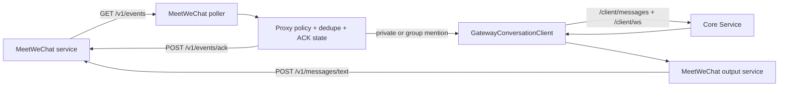

# Bot Integration Design

## 1. Current Scope

V3 的微信接入统一切换为 `MeetWeChat Client`。Core 不再直接维护旧微信登录、长轮询或 `context_token` 状态；真实微信账号由已经部署的 MeetWeChat 服务持有，MeetYou 只通过 `docs/MeetWechat_API.md` 定义的 `/v1` HTTP API 接入。

本轮范围只支持文本消息：

- MeetYou 后台轮询 `GET /v1/events`
- 跳过或处理入站事件后调用 `POST /v1/events/ack`
- 需要回复时调用 `POST /v1/messages/text`
- 继续作为外部 Client 走正式 `/client/* + /client/ws` 主链
- 每条入站消息显式携带 `tool_scope=basic` 和基础工具白名单，Core 本轮只向该 Client 暴露共享基础工具

旧微信 client、adapter、配置项、测试和历史说明已移除，不再保留旧配置入口。

## 2. Runtime Shape



模块边界：

- `adapters/meetwechat_client.py` 封装 MeetWeChat `/v1` API。
- `sensors/meetwechat_adapter.py` 负责轮询通知、代理规则、去重、ACK 补偿、群聊发言人区分、Core 输入桥接与回复输出。
- `core/app_lifecycle.py` 只在 `enable_meetwechat_client=true` 时挂载新客户端。
- `clients/gateway_client.py` 支持传入已有 `thread_id`，用于微信会话跨重启复用 Core thread。

## 3. Proxy Rules

默认策略为 `guarded_auto`：

- 私聊文本默认进入助理并允许自动回复。
- 群聊普通文本只 ACK，不自动回复。
- 群聊 `is_group_mention=true` 时进入助理并允许回复。
- `is_self=true`、非文本、空文本直接跳过并 ACK。
- `manual_only`、`mute` 不进入 Core；`read_only` 进入 Core 但不发送回复。

会话键：

- 私聊：`wechat:meetwechat:chat:{chat_id}`
- 群聊：`wechat:meetwechat:group:{chat_id}`

群聊发送人区分：

- metadata 保留 `chat_id`、`sender_id`、`sender_name_present`、`sender_alias`、`message_id`、`event_id`。
- 群聊输入会添加稳定前缀，例如 `member#4f2a: ...`。
- confirm 与 human-input 按 `chat_id + sender_id` 绑定，只有触发该请求的群成员可以继续响应。

发送策略：

- 同一 `chat_id` 串行处理，避免并发多条回复。
- 回复前短延迟，长文本按 `meetwechat_max_text_chars` 自然分段。
- `idempotency_key` 使用 `meetyou:{event_id}:{fragment_index}`。
- 群聊发送统一携带 `is_group_mention=true`，符合 MeetWeChat 群聊出站约束。

## 4. Basic Tools

MeetWeChat Client 默认开放共享基础工具，不开放本地文件、Shell、Desktop Agent 或边缘 Agent 能力。入站 metadata 带有：

- `tool_scope=basic`
- `allowed_tool_bundle=[...]`
- `allowed_mcp_servers=[]`

当前基础工具白名单包括：`ask_human`、`get_current_system_time`、`list_skills`、`load_skill`、`create_skill`、`manage_procedures`、`switch_workspace`、`search_knowledge`、`search_memory`、`search_web`、`read_web_page`、`remember_knowledge`、`manage_memories`、`summarize_text`、`organize_notes`、`extract_action_items`。

## 5. Notification And ACK

MeetWeChat 当前没有入站推送，MeetYou 建立内部轮询通知机制：

- 后台按 `meetwechat_poll_interval_seconds` 调用 `/v1/events?limit=20`。
- 轮询失败按 `meetwechat_error_backoff_seconds` 指数退避，最高 30 秒。
- 本地状态文件 `meetwechat_state_file` 保存事件状态、待补 ACK、Core thread 绑定和群成员别名。
- 已跳过、已交给 Core 且无需回复、或回复发送成功后 ACK。
- Core 处理失败或发送失败时不 ACK，依靠 MeetWeChat pending 队列和本地幂等状态重试。
- ACK 失败会保留 `ack_pending`，下一轮优先补偿。

## 6. Configuration

新增配置：

- `enable_meetwechat_client`
- `meetwechat_base_url`，默认 `http://127.0.0.1:38961`
- `meetwechat_poll_interval_seconds`，默认 `2`
- `meetwechat_error_backoff_seconds`，默认 `2`
- `meetwechat_max_text_chars`，默认 `1800`
- `meetwechat_state_file`，默认 `user/meetwechat_client_state.json`
- `meetwechat_proxy_policy`，JSON 对象，默认 `guarded_auto`

可用环境变量覆盖：

- `MEETYOU_MEETWECHAT_ENABLE`
- `MEETYOU_MEETWECHAT_BASE_URL`
- `MEETYOU_MEETWECHAT_POLL_INTERVAL_SECONDS`
- `MEETYOU_MEETWECHAT_ERROR_BACKOFF_SECONDS`
- `MEETYOU_MEETWECHAT_MAX_TEXT_CHARS`
- `MEETYOU_MEETWECHAT_STATE_FILE`

## 7. Verification

最小自动验证：

```powershell
.venv\Scripts\python.exe -m unittest tests.test_meetwechat_client tests.test_meetwechat_adapter tests.test_config_manager tests.test_service_runtime
```

真实链路验收应低频顺序执行：

1. `GET /v1/health`
2. 私聊文本收发
3. 群聊普通消息不回复
4. 群聊 @ 回复
5. `manual_only` 阻断

验收记录不得包含完整聊天正文、联系人名、cookie 或 token。
